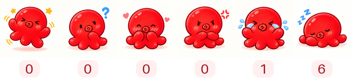

  

<!-- 技术栈依据 XINGYI-PU 的公开项目 README 和依赖清单整理，2026-10-02。 -->

## 🛠️ Tech Stack

| Property                    | Data                                                                                                                                                                                                                                                                                                                                                                                                                                                                                                                                                                                                                                                                                                                                                                                                                      |
| :-------------------------- | :------------------------------------------------------------------------------------------------------------------------------------------------------------------------------------------------------------------------------------------------------------------------------------------------------------------------------------------------------------------------------------------------------------------------------------------------------------------------------------------------------------------------------------------------------------------------------------------------------------------------------------------------------------------------------------------------------------------------------------------------------------------------------------------------------------------------ |
| **Languages / Notebooks**   |                                                                                                                                                                                                                              |
| **Domain Knowledge**        |                                                                                                                                                                                                                                                                                                                                                                                                                                                           |
| **Frameworks / Libraries**  |         |
| **Tools / CI / CD**         |                                                                                                                                                                       |
| **Data Stores / Retrieval** |                                                                                                                                                                                                                                                                                                                                                                                                                                              |

## 📈 GitHub Activity Graph

<picture>
  <source media="(prefers-color-scheme: dark)" srcset="./assets/github-snake-dark.svg">
  <source media="(prefers-color-scheme: light)" srcset="./assets/github-snake.svg">
  
</picture>

## 🌱 3D Contributions

  

## 📅 Contributions Calendar

  

## ⭐ Star History

<!-- 默认跟踪个人主页仓库；可把下方所有 XINGYI-PU/XINGYI-PU 改为自己的项目仓库。 -->
<a href="https://star-history.com/#XINGYI-PU/XINGYI-PU&amp;Date">
  <picture>
    <source media="(prefers-color-scheme: dark)" srcset="https://api.star-history.com/svg?repos=XINGYI-PU/XINGYI-PU&amp;type=Date&amp;theme=dark">
    <source media="(prefers-color-scheme: light)" srcset="https://api.star-history.com/svg?repos=XINGYI-PU/XINGYI-PU&amp;type=Date">
    
  </picture>
</a>

## 👀 Profile Views

  
  

Thank you for visiting my profile.

